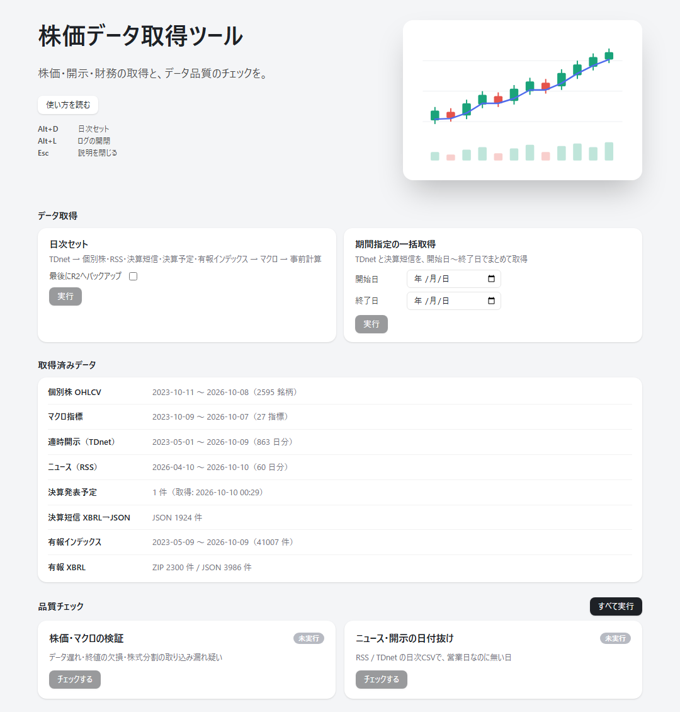

# 番外編：データ取得を「押すだけ」にする ― 取得ツールを Claude と作る

[1-1](01-01_get_stock_prices.md)〜[1-3](01-03_xbrl_to_json.md) では、無料のデータは取得できる、という解説をしました。ただ、実際に **毎日** 貯めていくとなると、スクリプトを個別に呼び、ログを見て、抜けや遅れを目で確かめる作業が意外に手間です。

そこで、取得と点検を **ひとつの画面** にまとめた「株価データ取得ツール」を作りました。この番外編では、その画面と考え方を紹介し、最後に **同じようなツールを Claude に作ってもらうためのプロンプト** を載せます。

<div class="keypoint" markdown="span">**― 押すだけで取得、取得済みの期間と品質まで一画面 ―**</div>

<p class="fig-meta"><i class="fa-solid fa-expand"></i> クリックで拡大</p>

{width="1200"}

## 画面は「4つ」だけ

画面は上から、次の4つで構成しています。

| 区画 | 役割 |
|---|---|
| **データ取得** | 「日次セット」と「期間指定の一括取得」の2つのボタン |
| **取得済みデータ** | データごとの取得済みの期間と件数（読み取り専用） |
| **品質チェック** | データの遅れ・欠損・日付抜けの点検 |
| **実行ログ** | 実行中の処理の状態・経過時間・出力の全文 |

最初は、データの種類ごとにボタンを並べていました。しかし、ボタンが多すぎて **どれを押せばよいか迷う** ため、毎日必要なものをすべて取ってくれる日次セットと、遡って取る期間指定の **2つだけ** に絞りました。

- **日次セット**：毎日の更新。適時開示 → 個別株・ニュース・決算短信・決算発表予定・有報インデックス → マクロ指標 → 銘柄検出の事前計算
- **期間指定の一括取得**：開始日〜終了日の適時開示と決算短信を、まとめて遡って取得

「どこまで貯まっているか」は、取る前に **取得済みデータ** の一覧で確かめられます。

## 日次セットは「順番」に意味がある

日次セットは、すべてを一斉に動かすのではなく、**段階** に分けて実行します。

1. **適時開示（TDnet）**：決算短信の取得が、保存済みの適時開示の一覧を読むため、最初に済ませる
2. **個別株・ニュース・決算短信・決算発表予定・有報インデックス**：取得先がバラバラなので、並行して動かして時間を縮める
3. **マクロ指標**：個別株と同じ yfinance から取るので、同時には動かさず、個別株のあとに回す
4. **銘柄検出の事前計算**：取得したデータをもとに、全銘柄の指標をあらかじめ計算しておく

「何を同時に動かしてよいか」「何を先に終えるべきか」を決めておくのが、取得を自動化するときの設計の要です。

## yfinance には、速さより「配慮」を優先する

株価は yfinance から取っています。これは無料で公開されている仕組みで、Yahoo の公式な API ではありません。短時間に多くの要求を送ると、相手に負担をかけ、制限を受けて取れなくなるおそれもあります。そのため、**時間がかかっても、負担をかけない取り方** を選びました。

- **1銘柄ずつ、1回ごとに 0.5 秒あける**（一括取得や並列化はしない）
- **日足は、増えた分だけ取る**（毎回、全期間を取り直さない）
- **補正（株式分割・配当）があった銘柄だけ、全期間を取り直す**
- **制限を受けたら 2 分待って 1 回だけ再試行**し、上場廃止などでデータがない銘柄は再試行しない

## 品質チェックで、取りこぼしに気づく

取得して終わりにせず、「ちゃんと取れているか」をすぐ確かめられるようにしました。異常は、分析で数字がおかしいと気づいてから原因をたどるより、**取得の直後に見つけたほうが直しやすい**からです。

- **株価・マクロの検証**：最新日の遅れ、終値の欠損、前日比が極端に動いた日（株式分割の取り込み漏れの疑い）
- **ニュース・開示の日付抜け**：営業日なのに、日次ファイルがない日

> 日付抜けのチェックは、祝日を営業日として数えます。「なし」と出た日が祝日なら、異常ではありません。

使い方・仕組み・設計判断の詳細は、技術解説の「[株価データ取得ツール](../../tech/data-hub.md)」にまとめています。

## 同じものを Claude に作ってもらう

このツールのコードは公開していません（提供元の利用条件上、データそのものを公開しないためです）。その代わり、**同じ考え方のツールを Claude に作ってもらうプロンプト** を載せます。そのまま貼り付けて、`【　】` の部分を自分の環境に合わせて書き換えてください。

```text
あなたはシニアのPythonエンジニアです。
自分のPC（Windows）だけで動く、データ取得と品質チェックのローカルWebツールを作ってください。

# 目的
・株価・適時開示・ニュース・決算などを、毎日きちんと貯めていく。
・取得は「押すだけ」にし、取得済みの期間と、データの異常がすぐ分かるようにする。

# 前提
・取得スクリプトは既にあります（【ingest/ フォルダに、取得先ごとに1ファイル。例：fetch_prices.py, fetch_news.py】）。
  このツールは、それらを「呼び出して、結果を見せる」だけにしてください。取得ロジックは書き直さないこと。
・保存先は【data/ 以下。例：data/prices/, data/news/】。

# 技術構成
・サーバー：FastAPI。127.0.0.1 だけで待ち受ける（外部公開しない）。
・画面：ビルド工程のない素の HTML / CSS / JavaScript。フレームワークは使わない。
・取得の実行：各スクリプトを別プロセス（subprocess）で起動し、出力を1行ずつ記録する。
  画面を閉じても取得は止まらない。画面は数秒ごとに状況を問い合わせる（ポーリング）。
・起動は start.bat を実行するだけ。終了は黒いウィンドウを閉じる。

# 画面（上から順に、1ページ）
1. データ取得：ボタンは次の2つだけ。
   ・「日次セット」：毎日の更新。段階に分けて実行する（下記）。
   ・「期間指定の一括取得」：開始日と終了日を入れて、過去分をまとめて取得する。
2. 取得済みデータ：データごとに、取得済みの期間と件数を一覧で表示（読み取り専用）。
3. 品質チェック：カードごとに「チェックする」ボタン。結果は「問題なし／要確認／NG／参考」で表示。
   全部まとめて実行する「すべて実行」ボタンも付ける。
4. 実行ログ：各処理の状態（待機／実行中／完了／失敗）・経過時間・最新の1行を表示。
   行をクリックすると出力の全文が開く。失敗した行は自動で開く。
   数秒ごとの更新で画面を作り直しても、ページのスクロール位置が上に戻らないこと
   （一番下まで引っ張った状態を保つ）。ログは一度に差し替え、開いている行や各行のスクロール位置も保持する。

# 日次セットの段階（順番に意味があるので、段階に分けて実行する）
・段階1：【先に終わらせる必要があるもの。例：適時開示】
・段階2：【取得先が別々で、並行してよいもの。例：個別株・ニュース・決算短信】
・段階3：【同じ取得先を使うので、段階2のあとに回すもの。例：マクロ指標】
・段階4：【取得後の加工。例：事前計算】
同じ段階の中は並行して動かし、段階どうしは順番に動かす。

# 実行の安全策
・同時に実行できるのは1件だけ。実行中は全ボタンを無効にし、サーバー側でも二重実行を断る（409を返す）。
・品質チェックは読み取り専用。データファイルを書き換えない。
・実行中の取得を止める機能は作らない（止めたいときは黒いウィンドウを閉じる）。

# 無料データ提供元への配慮（株価を yfinance 等から取る場合）
・1銘柄ずつ順番に取り、1回ごとに0.5秒あける。一括取得や並列化はしない。
・日足は、手元の最終日以降だけを取り、既存データに継ぎ足す（毎回、全期間を取り直さない）。
・株式分割・配当で過去の株価が補正された銘柄は、そこだけ全期間を取り直す。
・レート制限を受けたら2分待って1回だけ再試行。データがない銘柄は再試行しない。
・同じ提供元を使う取得は、同時に動かさない。

# 品質チェック（最低限）
1. 株価の検証：最新日が基準営業日より5日超遅れていたら「要確認」。終値が空なら「要確認」。
   前日比が約0.55倍以下／1.8倍以上なら「参考（株式分割・統合の疑い）」。
2. ニュース・開示の日付抜け：直近60日の営業日のうち、日次ファイルがない日を数える。
   （祝日は考慮しない。画面に「祝日は『なし』と出ることがあります」と注記する）

# 出力してほしいもの
・ファイル構成（tree）と、各ファイルの役割の説明
・server.py / catalog.py（取得メニューと取得済み期間の集計）/ quality.py / fetch_jobs.py（実行役）/ static/index.html・app.js・style.css / start.bat
・動かし方（初回セットアップから起動まで）
・まず日次セットだけを動く形で作り、動作確認してから、品質チェックと期間指定を足す順で進めてください。
```

ポイントは、**取得ロジックを書き直させない**ことと、**順番・同時実行・配慮のルールを先に決めて伝える**ことです。ここを曖昧にすると、Claude は「全部を一斉に動かす」素直な実装を作ってしまい、あとで取得先に負担をかけたり、ファイルを同時に書き換えて壊したりします。

## まとめ

- 取得は **「日次セット」と「期間指定」の2つのボタン** に絞ると、迷わず毎日続けられる
- 日次セットは **順番に意味がある**。先に終わらせるもの、並行してよいもの、同時に動かさないものを分ける
- 無料の提供元には **速さより配慮**。1件ずつ間隔をあけ、増えた分だけ取る
- 取得の直後に **品質チェック** を置くと、取りこぼしに早く気づける
- 同じものを作るなら、**ルールを先に決めて Claude に渡す**。プロンプトの雛形を使ってください

---
