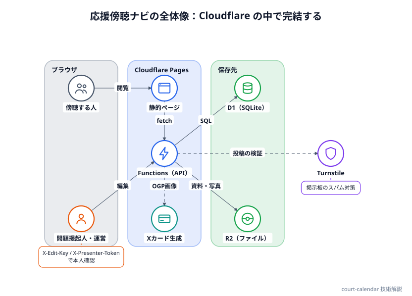
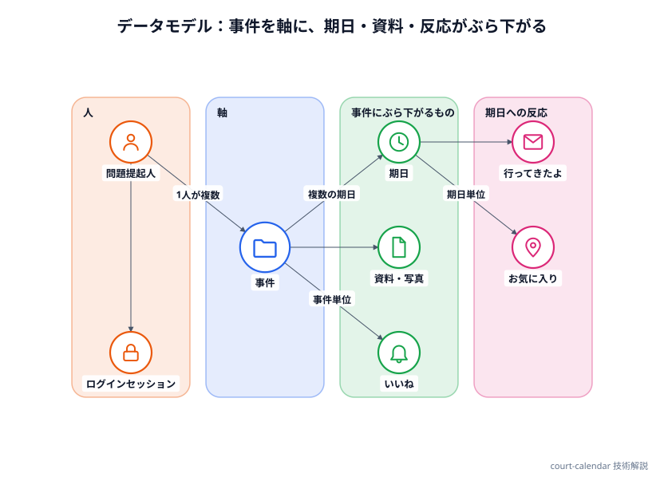
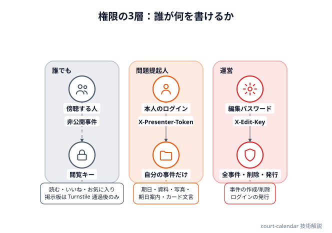
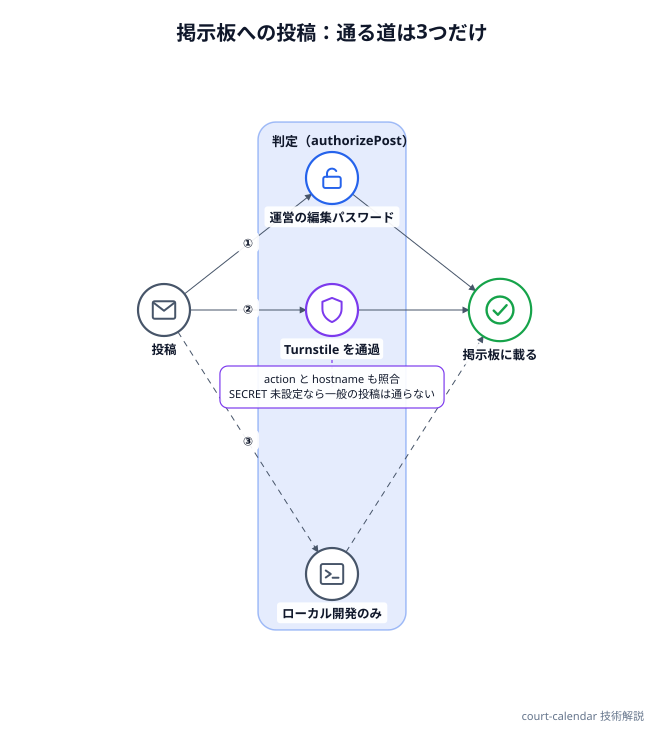

# 応援傍聴ナビ

民事裁判の期日（いつ・どこで開かれるか）と、傍聴席の様子をみんなで共有するカレンダーサイトです。友人と共同運営しています。事件ごとの詳細ページ（争点・当事者・期日・訴訟資料・写真）、傍聴に行った人が書き込む「行ってきたよ」掲示板、X で共有したときに出るカード画像の自動生成などの機能があります。

サーバーは自前では持たず、Cloudflare の Pages（ページと API）・D1（データベース）・R2（ファイル置き場）だけで動いています。フロントエンドはビルド工程のない素の HTML / CSS / JavaScript で、フレームワークは使っていません。

- 公開ページ：[court-calendar-6q8.pages.dev](https://court-calendar-6q8.pages.dev/)
- ソース：[github.com/minnanosaiban/court-calendar](https://github.com/minnanosaiban/court-calendar)

このページは、その仕組みと、作るうえで判断したことの解説です。

## 全体の構成

{width="700"}

```
public/
  index.html        カレンダー・「最近の期日」「今後の期日」
  case.html         1つの事件の詳細ページ（?id=事件ID）
  cases.html        事件をさがす（検索・タグで絞り込み）
  case-edit.html    事件情報の編集（全画面ページ）
  presenter.html    問題提起人のページ（その人の事件一覧）
  login.html        問題提起人のログイン
  lib.js            各ページ共通のロジック（約2,700行）。window.CC として公開
  style.css         共通のスタイル
  fonts/            書体（Shippori Mincho・Zen Kaku Gothic New）
functions/
  _common.js        共通処理（認証・権限・変換・投稿の可否判定）
  api/              REST 的な API（cases / events / materials / images / posts ...）
  files/[[path]].js R2 のファイルを配信
  case.js           事件ページの <head>（OGP）を、配信の直前に書き換える
schema.sql          D1 のテーブル定義（最新の形）
migrate_NNN_*.sql   番号つきの一度きりのマイグレーション
```

API は Cloudflare Pages Functions で、ファイル名がそのままURLになります（`functions/api/cases/[id]/like.js` は `POST /api/cases/:id/like`）。画面は `lib.js` が `fetch` でこの API を呼び、返ってきたJSONから描きます。アカウント管理やメール送信のための外部サービスは使っていません。

### ブラウザに持たせるもの

ログインや「いいね」のために、ブラウザの localStorage に次の値を持たせています。どれも `court-calendar.` で始まるキーです。

| キー | 中身 | 用途 |
|---|---|---|
| `viewer` | 端末ごとのランダムな文字列 | いいね・お気に入りの「1端末1回」の判定 |
| `viewkeys` | 事件ごとの閲覧キー | 非公開の事件を開く |
| `presentertoken` | ログインのトークン | 問題提起人としての本人確認 |
| `editkey` | 編集パスワード | 運営としての書き込み |

これらはリクエストごとにヘッダ（`X-Viewer`・`X-View-Keys`・`X-Presenter-Token`・`X-Edit-Key`）で API に送ります。Cookie は使いません。

## データモデル

{width="700"}

中心は**事件（`cases`）**です。当事者・争点・よびかけ・リンクなど、事件に属するものは `cases` に1回だけ持ち、期日（`events`）は `case_id` で事件にぶら下がります。以前は「1期日＝1行」で、同じ事件の説明を期日ごとに重複して保存していました。事件を独立させたのは、説明を直すたびに全期日を直す必要をなくすためです。

- **問題提起人（`presenters`）**：アイコン＋ニックネーム。1人が複数の事件を持てます（同じ人・団体が別件で複数の訴訟を抱えている場合）
- **期日（`events`）**：日時・種類（第3回口頭弁論など）・裁判所・法廷・公開／非公開・期日報告会の有無。「この回で原告・被告が主張したこと」も持ちます
- **訴訟資料（`materials`）**：書面・証拠・判決などの目録。ファイルは R2 に置くか、URL だけ登録します。ファイルを付けない「目録だけ」の登録もできます
- **事件の写真（`case_images`）**：詳細ページ上部に横に流して見せます。スマホ向けの版とは別に、Web 向けの版も登録できます
- **いいね（`likes`）**：事件単位で、件数を表示します
- **お気に入り（`event_bookmarks`）**：期日単位で、件数は出さない自分専用の目印です。いいねとは別の概念として分けています
- **行ってきたよ（`posts`）**：期日に紐づく傍聴報告（後述）

### 「誰が」を保存しない

いいねとお気に入りに必要なのは「同じ端末が2回押していない」ことだけです。そこで、端末ごとに作ったランダムな文字列（`viewer`）を、サーバー側で SHA-256 にかけた値だけを `(case_id, viewer)` の主キーとして持ちます。アカウントも、IP アドレスも、保存しません。

### マイグレーションは積む

テーブルを変えるたびに、`migrate_NNN_内容.sql` という一度きりのSQLを書き、本番のDBに流します。`schema.sql` は常に最新の形で、新しく作るならこれだけで足ります。D1 では外部キー制約の強制を前提にしていないので、`ON DELETE CASCADE` は付けていません。**事件を削除したときに、期日・資料・写真・いいねなどを消す処理は、コード側（`functions/api/cases/[id].js`）に書いています。** 新しいテーブルを足したら、ここにも DELETE 文を足す、とスキーマのコメントに書いて忘れないようにしています。

## 書き込める人を3つに分ける

{width="700"}

| 立場 | 本人確認 | できること |
|---|---|---|
| 誰でも | なし（端末の識別子のみ） | 読む・いいね・お気に入り。掲示板への投稿は Turnstile を通ったときだけ |
| 問題提起人 | ログインID＋パスワード → トークン | **自分の事件だけ**、期日・資料・写真・期日案内・カード文言などを登録・変更 |
| 運営 | 編集パスワード | すべて。事件の新規作成・削除、別の問題提起人への付け替え、ログインの発行も運営だけ |

書き込みの判定は、`functions/_common.js` の `authorizeCaseWrite` に集めています。運営なら全事件を許可、問題提起人なら `cases.presenter_id` が自分の事件だけを許可、事件IDのない操作（新しい事件を作る）は問題提起人には許可しません。新しい事件や問題提起人の「箱」を最初に作るのは運営で、ログインを発行したあとの中身の登録・変更は本人が行う、という運用の分担を、そのまま権限にしています。

なお、Cloudflare Access（Google ログインで閲覧を制限する仕組み）に対応するコードも残してあります。ただ、現在の運用は「誰でも閲覧でき、書き込みは編集パスワードかログインの本人だけ」です。

### パスワードの扱い

- 問題提起人のパスワードは、PBKDF2-SHA256（反復10万回、人ごとのソルト）でハッシュ化して保存します。平文は保存しません
- 運営がパスワードを発行すると、その場に平文が**1回だけ**表示されます。あとから表示し直すことはできません（控えて本人に伝える）
- 再発行やログインの削除をすると、その人の既存のログインセッションはすべて失効します
- ハッシュ化はログインのときにしか行いません。書き込みのたびに重い計算をしないよう、ログイン後はランダムなトークン（365日）で本人確認します

## 非公開の事件：閲覧キー

事件ごとに、閲覧キー（`cases.view_key`）を設定できます。値がある事件は、キーを知っている人にしか見えません。キーは URL の `?key=` か、ブラウザが覚えた `viewkeys` から、リクエストのヘッダ `X-View-Keys` に載って届きます。

API の一覧系は、結果を返す前に `hiddenCaseIds()` で「このリクエストに見せてはいけない事件」を除きます。**事件に紐づく行を返すエンドポイントを足すときは、必ずここを通す**という決まりにしています。

この仕組みは、実際に抜けを出して直した経験から、次の形になっています。

- **問題提起人ページの OGP に、非公開事件の名前が出ていた**（2026-09-10）。一覧系 API は絞っていたのに、HTML の `<head>` を書き換える側が絞っていなかった。いまは問題提起人まわりも同じ関数で絞っています
- **ファイルの配信が別経路だった**。資料PDF・写真・期日案内は `/files/` から R2 を直接返すので、API の絞り込みを通りません。そこで、配信してよい種類と、非公開判定が要る種類を `FILE_PREFIXES` の1か所にまとめ、非公開の事件のファイルは `?key=` が合わなければ 404 にしています（403 ではなく 404 にして「存在しないもの」として扱う）。以前は「配信してよい一覧」と「非公開判定の一覧」が別のファイルにあり、片方だけ更新して漏れました
- **リンク展開ボットは鍵付きURLを読める**。非公開事件の鍵付きURLをチャットに貼ると、そのアプリの展開ボットが URL を取りにきて、カードやタイトルを取得し、共有先の全員に見えてしまう。そのため、非公開の事件では、`?key=` が正しくても `<head>` の書き換えとカード画像の配信をしません（ページを開いたあとに、クライアントが鍵を照合して中身を出すので、鍵を持つ人の閲覧はこれまでどおりできる）

非公開の事件番号（`case_no_public`）も同じ考え方で、公開してよいと決めた場合だけ表示し、本人（問題提起人）にはいつも見せます。

## 行ってきたよ掲示板

{width="700"}

傍聴に行った人なら誰でも書ける、期日ごとの報告です。誰でも書ける場所は荒れやすいので、**文の形を固定**しています。

- 誰が：原告／被告／裁判官（選択）
- 何を：自由記入（60字まで）
- 何をした：主張した／求めた（選択）

表示は「原告は『◯◯』と主張しました」の1文だけです。自由に書けるのはかぎ括弧の中の短い引用だけで、感想や評価、誹謗中傷を書く場所がありません。サーバー側も、選択肢にない語と60字を超える引用は受け付けません。

投稿は期日（`event_id`）に紐づきますが、事件のカードでは**同じ事件の全回をまとめて**出し、頭に回（第7回口頭弁論など）を添えます。そうしないと、これから開かれる期日のカードでは、掲示板がいつも空になってしまうためです。

### スパム対策：投稿は3つの道だけ

投稿の可否は `authorizePost` が判定します。通るのは次の3つだけです。

1. 編集パスワードを知っている運営
2. Cloudflare **Turnstile**（CAPTCHA の代わりになる検証）を通過した人
3. ローカル開発のとき（`LOCAL_DEV="true"`。本番には置かない）

Turnstile のトークンは、`success` だけでなく **`action`（この掲示板のウィジェットで取られたか）と `hostname`（本物のサイトで取られたか）も**サーバーで照合します。トークンの使い回しや、別のサイトで取ったトークンを通さないためです。

事件ごとに、掲示板そのものを出さない設定と、投稿を運営とその事件の問題提起人だけに絞る設定も持てます（絞った事件は、Turnstile を通った匿名の投稿を受け付けません）。

さらに、**Turnstile の秘密鍵が未設定の間は、一般の投稿は1件も通りません。** 設定の漏れがあっても、公開した直後から荒れることはありません（`/api/me` の `boardOpen` も同じ条件で、画面は投稿欄を出さない）。荒れたときは、運営が各投稿の「消す」で非表示にできます。

## X で共有したときのカード（OGP）

事件のページを X や LINE で共有すると、タイトル・説明・画像のカードが出ます。静的な HTML のままでは、共有のたびに同じカードになってしまうので、**配信の直前に `<head>` だけを書き換え**ます。

- `functions/case.js` が `/case?id=…` へのアクセスだけを受け、`case.html` を取ってきて、`<title>` と OGP のタグを事件ごとの値に置き換えて返す。ページの中身の描画は、これまでどおりクライアント側の `lib.js` が行う
- 検索結果・共有の見出しは、編集画面で入れてあればそれを使い、空なら事件名とよびかけから自動で作る

画像は、事件ごとの「傍聴券」を**その場で描いて**返します（`/api/cases/:id/card.png`）。直近の期日・問題提起人を D1 から読み、`@cf-wasm/og`（JSX から PNG を作るライブラリ）で描きます。

- 横長版（1200×630）と正方形版（1200×1200）の2枚を作る。Teams や Slack の多くは、og:image を正方形に中央トリミングして小さく出すので、横長のままだと日付や問題提起人が切れるため（X が読む `twitter:image` には横長を渡す）
- 以前は手でPNGを作って登録していたが、期日が変わるたびの差し替えが必要だった。D1 の最新のデータから描くので、差し替え作業がなくなった。手で作った画像を入れたいときのために、R2 に差し替え用の画像があればそちらを優先する
- カードのURLに、事件の更新時刻（`cases.updated_at` と、その事件の期日の最新の `updated_at`）を `?v=` として付ける。文言や期日を変えたときに、チャットアプリや CDN が古い画像を出し続けないため。期日だけを更新してもカードに反映されない抜けが、あとから見つかって直しました
- 書体（Shippori Mincho・Zen Kaku Gothic New）は、サイトに置いたフォントファイル（`public/fonts/`）を `env.ASSETS` から読み、メモリに覚えて画像の描画に渡す。外部のフォント配信は使わない

## デザイン

罫線を使わず、余白と背景色の差で区切る方針です。見出しは太字ではなく大きさで立て、装飾は無彩色寄りにして、使う色は朱色とその薄い変種にとどめています。

| トークン | 値 | 用途 |
|---|---|---|
| `--bg` | `#f3f2ee` | ページの背景 |
| `--card` | `#ffffff` | カードの背景 |
| `--ink` | `#221f1a` | 本文 |
| `--mut` | `#6b695f` | 補助の文字（白地で約5.3:1・WCAG AA） |
| `--faint` | `#a8a59a` | 飾りだけ（文字には使わない） |
| `--stamp` | `#b93226` | 朱色。印・見出しの一部・掲示板の背景（薄めて使う） |
| `--tint` | `#f8f7f4` | ごく薄い灰色（タグの背景など） |
| `--edit` | `#3f6d91` | 編集の操作だけ（白地で約5.5:1・WCAG AA） |

文字の大きさ・余白・角丸は段階（スケール）を決めて、その値だけを使います。カードの組み方、掲示板の背景色、お知らせ帯などの決まりは、リポジトリの `DESIGN_SYSTEM.md` に記録しています。

### お知らせ帯

全ページの最上部に、関連サイトへのリンクを右から左へ流す帯があります。動き続けるものは止められなければならない（WCAG 2.2.2）ので、次のようにしています。

- ポインタを乗せている間は止まる（`@media(hover:hover)` に限る。スマホで押したまま止まるのを避けるため）
- ⏸ボタン、キーボードで焦点が入ったとき、OSの「視差効果を減らす」設定のときは、流すのをやめて全件を折り返して並べる。止めたあとも、すべてのリンクに届く
- ⏸の状態は localStorage に保存し、次のページにも引き継ぐ
- 流すための2つ目の列は、読み上げと Tab 移動の対象から外す
- 帯は `announce.js` の `LINKS` だけで中身が決まり、全ページに効く。表示のあとに差し込むとページ全体が下へずれるので、`<body>` の直後で同期的に読み込む

## 限界と今後

- **検索は簡易です。** 事件名での検索とタグの絞り込みだけで、期日や資料の本文を横断して探すことはできません
- **非公開は「合言葉」です。** 閲覧キーを知っていれば誰でも見られます。個人ごとのアカウントで見える人を分ける仕組みではありません。一度渡った `/files/` のURLは、鍵を変えたあとも有効なままです
- **一般の人のアカウントはありません。** 傍聴する人は匿名のままで、編集できるのは問題提起人と運営だけです
- **掲示板の削除は運営だけです。** 荒れたときの対応は人手で、自動で判断する仕組みはありません
- **資料の要約や主張には、AIが作ったものがあります。** どのAIモデルで・いつ作ったかを、資料・期日ごとに記録して表示します（手入力の場合は空にします）

## デザインシステム

画面の細かい寸法・スケールの一覧は、リポジトリの [DESIGN_SYSTEM.md](https://github.com/minnanosaiban/court-calendar/blob/main/DESIGN_SYSTEM.md) にあります。
