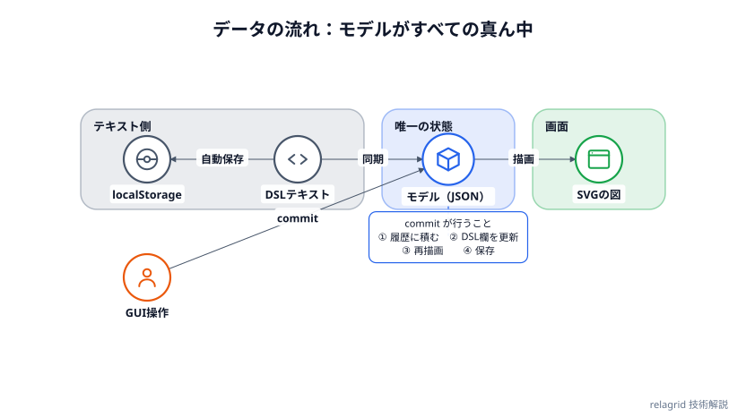

# ＲｅｌａＧｒｉｄ　関係図

グリッドにアイコンのノードを置き、矢印でつないで関係図を作るツールです。マウスで描く方法と、短いテキスト（DSL）で書く方法があり、両者は常に同期します。サーバーはなく、静的ファイルを GitHub Pages に置いているだけです。**描いた図は、自分のパソコンの外に出ません。** 処理はすべてブラウザの中（JavaScript）で行います。

- 公開ページ：[minnanosaiban.github.io/relagrid](https://minnanosaiban.github.io/relagrid/)
- ソース：[github.com/minnanosaiban/relagrid](https://github.com/minnanosaiban/relagrid)

このページは、その仕組みと、作るうえで判断したことの解説です。

## 全体の構成

ビルド工程のない素の HTML / CSS / JavaScript です。フレームワークもバンドラーも外部ライブラリも使っていません。`index.html` にはほかのサイトのURLが1つもなく、書体もOS標準のものを使うので、ページを開いても外部へのアクセスは起きません。

```
index.html
css/style.css
js/
  icons.js       アイコン素材（38種類・手描きのSVG断片）
  colors.js      配色パレット（9色 × ライト/ダーク）
  model.js       データモデル / グリッド参照（A1 など）のヘルパー
  parser.js      DSLテキスト → モデル
  serializer.js  モデル → DSLテキスト
  renderer.js    モデル → SVG
  samples.js     サンプル図
  app.js         GUI操作・状態管理・保存・書き出し
tests/run.js     パーサ・シリアライザの回帰テスト
```

ES Modules は使わず、各ファイルを `<script>` で順に読み、`window.RelaGrid` という1つの名前空間にぶら下げています。そのため `index.html` をダブルクリックして開く（`file://`）だけで動きます。読み込み順がそのまま依存関係です。

データは、すべて真ん中の「モデル」を通ります。

{width="700"}

- **DSLテキスト ⇄ モデル**：テキストを書くと `parse` でモデルになり、GUI で編集すると `serialize` でテキストが書き直されます
- **モデル → 画面**：モデルから SVG を描きます（画面もこの経路です）
- **GUI 操作 → モデル**：操作は必ず `commit` を通ります（次の節）
- **保存**：保存されるのは、モデルではなく DSL テキストです

## 図の状態は「モデル」ひとつで持つ

画面の状態は、`state.model`（ただのJSONオブジェクト）にまとめています。

```js
{ grid: {cols, rows}, theme, title, source, textScale,
  zones: [], nodes: [], edges: [], notes: [] }
```

画面（SVG）は、このモデルから**毎回まるごと描き直します**。差分更新はしていません。ノードが数十個の図なら、描き直しは一瞬で終わります。その代わり、「画面だけが先に変わって、モデルと食い違う」という種類の不具合が起きません。

状態を変える操作は、すべて `commit(newModel, opts)` を通します。操作の側は、現在のモデルを `cloneModel()`（`JSON.parse(JSON.stringify())`）で複製して書き換え、できた新しいモデルを `commit` に渡します。`commit` が次を一括で行います。

1. 変更前のモデルを undo スタックに積む（最大100件）
2. 選択状態を整える（消えた要素を選択したままにしない）
3. モデルからDSLテキストを作り直して左の欄に反映する
4. 再描画し、インスペクタを作り直す
5. 400ms のデバウンスで localStorage に保存する

記録漏れが起きない（commit を通らない変更がない）ことが、Undo / Redo が単純に済んでいる理由です。

## DSLとGUIの双方向同期

左のテキスト欄に書くと、300ms後に `parseDSL()` が走り、図が描き直されます。逆に、GUIで編集するとテキスト欄が正規の形に書き換わります。

```
grid 4x3
zone A1:B2 "Public zone" color=blue
node api B1 icon=server size=1.2 color=blue "API"
api -> db "SQL" style=dashed color=red width=2
note api "SLA 99.95%\np99<200ms" pos=bottom
```

パーサー `parser.js` は**1行1文**の素朴な作りです。

- 行末の `#` 以降はコメント。ただし `"…"` の中の `#` は文字として扱う
- 行を `"…"`（文字列）と空白区切りの語に分け（トークン化）、先頭の語が `grid` `node` `zone` `note` などのキーワードなら対応する関数に渡す
- どれでもなければ `<id> <op> <id>` の接続として読む
- `key=value` は順不同の属性。省略した属性は既定値になる

**文法エラーは行ごとに集めて、最後に返します。** 1行の間違いで全体が読めなくなることはなく、ステータスバーに「何行目が何のエラーか」を出します。エラーがある間は図を更新せず、**直前に描けていた図を残します**。タイピング途中の壊れたテキストで、図が消えたり点滅したりしないための判断です。

エラーとは別に**警告**もあります。存在しないノードへの接続、同じマスへの2ノード、グリッド外の座標、未知のアイコン名や色名などです。図は描けるので止めずに、ステータスバーに知らせるだけにしています。

### 正規化で失うもの

GUIで編集するたびに、テキストはシリアライザーが作り直した「正規の形」になります。つまり**手書きのコメントや行の並びは保持されません**（README にも制約として書いています）。コメントも保ちたいなら、パーサーが構文木（コメントを含む）を持つ必要があり、今のところそこまでの価値はないと判断しています。

### 保存するのはモデルではなくDSLテキスト

localStorage に入れるのは、JSONではなく**DSLテキストそのもの**です。起動時に同じパーサーを通すので、保存形式を変えても過去の保存が読めなくなる問題が起きにくく、手で直すこともできます。

## 描画：SVGを自前で組み立てる

`renderer.js` が、モデルから SVG を組み立てます。座標は固定の定数（1マス 168×132、余白 80/68、ノード半径 26 × サイズ）から機械的に決まります。**マスの座標さえ決まれば、ほかの要素の位置は計算で出る**というのが、グリッド方式のいちばんの利点です。

重ね順は、下から次のとおりです。

1. 背景・タイトル・出典
2. 各マスの透明な当たり判定（クリックのマス特定用）
3. グリッドの補助線（表示切替）
4. ゾーン（色付きの矩形）
5. 接続線
6. ノード（円＋アイコン＋ラベル）
7. ノート

### 文字の大きさは2回に分けて測る

SVG の `<text>` は、実際の幅が描くまで分かりません。ところが、ラベルの背景（白い帯）やノートの枠は、文字の幅に合わせたい。そこで、描画を3段階にしています。

1. 要素を組み立ててDOMに挿入する
2. ノートの文字を `getBBox()` で測り、枠・引き出し線・行の位置を確定する
3. ラベルの文字を測り、背景の矩形の大きさを決める

`getBBox()` は、DOMに挿入されていない要素では測れません。測定は挿入後であることが条件です。例外が出ても図全体は壊さないよう、測れなかった要素だけを飛ばしています。下側のノートは、ノードのラベルに重ならないよう、引き出し線の出発点と箱の位置をずらします。

### タイトルは「見積もり」で折り返す

タイトルと出典は、図が細い（縦長の図）ときにはみ出します。これは SVG が自動で折り返してくれないので、**DOMを使わずに幅を見積もって**折り返します。全角はフォントサイズ、半角は0.56倍として足し合わせるだけの粗い方法ですが、日本語中心の短い文なら十分です。文字の大きさを測るにはDOMが必要で、折り返しはDOMの前（図のサイズを決める段階）に必要という、順番の問題を避けるためです。文中の `\n`（バックスラッシュ＋n）で、明示的に改行もできます。

### 接続線は直線だけ

接続線は、2つのノードの中心を結んだ直線から、両端の円の半径ぶんだけ縮めたものです。矢印は SVG の `<marker>` で、色ごとに定義します。

直線だけなので、**途中のノードの上を線が通ったり、2本の線が重なったりする**ことがあります（A→B と B→A を両方引くと、1本に見えます）。直交ルーティングは、その分の複雑さに見合うかを見極められず、見送っています。ノードの置き場所（グリッド）を人が決められる前提で、並べ方で避けてもらう設計です。

## マウス操作

キャンバスのイベントは、ひとつの `pointerdown` で受けます。描いた要素には `data-kind`（node / edge / zone / note / cell）と `data-id` が付いているので、`event.target.closest('[data-kind]')` で「何をつかんだか」が分かります。選んでいるツール（選択・ノード・接続・ゾーン・ノート）で処理が分かれます。

- **ノードの移動**：ドラッグ中は、移動先のマスを枠で示すだけで、図の再描画はしません。離したときに空きマスなら `commit` します
- **ゾーン**：マスをドラッグして範囲を決める。途中の矩形は、ドラッグ中だけ見えるプレビュー用の要素を直接動かす
- **接続**：起点と終点のノードを順にクリック。Esc で取り消す
- **削除**：Delete / Backspace。ノードを消すと、つながる接続とノートも一緒に消える

接続線は細くてクリックしにくいので、見えない太い線（16px）を重ねて、当たり判定にしています。

タッチ操作や、ウィンドウの外で指を離したときに `pointerup` が来ないことがあります。そのままだと「ドラッグ中」の状態が残るので、`pointercancel` と、ポインタ捕捉が外れたときにも後始末をします。右クリックでは操作を始めません。

### スライダーは「離したとき」に確定する

ノードの大きさや線の太さのスライダーは、動かしている間は数値の表示だけを変え、**離したとき（`change`）に1回だけ `commit` します**。以前は動かすたびに `commit` していて、そのたびにインスペクタを作り直すため、つまみを握ったまま操作できなくなり、履歴も途中経過で埋まりました。「状態を変える操作は commit を通す」という原則は、**いつ通すか**も含めて設計に入る、という例です。

## 書き出し

| 形式 | 用途 |
|---|---|
| SVG | 拡大しても劣化しない。ほかのソフトで編集できる |
| PNG | そのままのサイズ（2倍の解像度） |
| PNG 16:9 | スライド向け。短い辺に余白を足して 16:9 にそろえる |
| PNG 縦（4:5） | X などの縦画像向け |
| JSON / テキスト | 図そのもの。読み込みで復元できる |

SVG と PNG は、画面に表示している SVG を複製して作ります。複製したものから、**編集のためだけにある要素を取り除きます**。マスの当たり判定、グリッドの補助線、ドラッグ中のプレビュー、接続線の見えない当たり判定、`data-*` 属性、選択中を示すクラスです。

PNG は、SVG を `Image` として読み込み、2倍のサイズの `<canvas>` に描いて作ります。余白を足すときのために、背景色は canvas 側で塗ります。

### 縦画像は「縦のまま」出す

横長の図を X に投稿すると、タイムラインで縮小されて文字が読めなくなります。そのため「PNG 縦」は、**図が4:5より縦長なら、そのまま出します**（横に余白を足して文字を小さくしない）。4:5より横長の図のときだけ、上下に余白を足して4:5にそろえます。あわせて、DSL の `textscale 1.3` で文字を大きくできます。縦長のサンプル（「…縦版・X投稿用」）が、その組み合わせの例です。

## 外から来るデータは「信用できない入力」として扱う

このツールが受け取るテキストは、自分で書いたものだけではありません。**AIが書いたDSL**、**ファイルから読み込むJSON・テキスト**、**前回の保存（localStorage）**があります。コードレビューで、この境界の守りが甘い箇所が見つかったので、2026年10月に直しました。

### グリッドの大きさに上限がなかった

画面のグリッド入力は 26×30 までに制限していましたが、パーサーにはなく、`grid 5000x5000` と書けてしまいました。描画はマスごとに透明な矩形を作るので、数千万個の要素でブラウザが固まります。しかも、そのテキストは自動保存されるため、**リロードしても起動時に同じものを読み込んで固まり続けます**。復旧には開発者ツールで保存を消すしかありません。

そこで、パーサーが 1〜26列・1〜30行の外を**エラー**にしました。古い巨大な値が保存に残っていても、起動時にエラーとして扱われ、空の図で立ち上がります。JSON の読み込みでも同じ範囲に丸めます。

### IDの検証と、書き出しの往復

ノードIDの入力欄は、空白を取り除くだけでした。`a b` や `grid` のような名前を付けると、テキストに書き出して読み直した時点で別の文として解釈されます（`grid -> x` は `grid` 文になる）。

IDを英数字・`_`・`-`（先頭は英字か `_`）に絞り、`grid` `node` などの予約語は使えないようにしました。同じIDの重複は**エラー**、同じマスへの重複配置とグリッド外の座標は**警告**です。GUI の入力欄にも、同じ判定を使っています。

文字列のエスケープにも穴がありました。`"` だけを `\"` にして、`\` を逃がしていなかったので、ラベルが `C:\` で終わると `"C:\"` になり、パーサーはその引用符を「エスケープされた引用符」と読んで文字列が閉じませんでした。今は `\` を先に `\\` にし、パーサー側（トークン化とコメント判定の両方）も `\"` と `\\` を1文字として読みます。`\n`（バックスラッシュ＋n）はこれまでどおりそのまま残り、描画側で改行になります。

### JSON は読み込み時に作り直す

JSON の読み込みは、以前は `Object.assign` で受け取ったオブジェクトをそのままモデルにしていました。`edges` が欠けていたり、座標が文字列だったりすると、描画の途中で落ちます。

今は項目ごとに型・範囲を確かめ、壊れた要素は捨て、数値は範囲内に丸め、未知の値は既定値にします。そのうえで、**いったんDSLに書き出して、もう一度パーサーに通します**。IDやグリッドの検証を、読み込み用にもう一度書かずに、パーサーの検証をそのまま使うためです。

### 色名・アイコン名をキーとして使わない

DSL の `color=…` や `icon=…` は、ユーザー（またはAI）が自由に書ける文字列です。次の2点を直しました。

- 辞書の参照に `hasOwnProperty` を使う。`icon=constructor` と書くと、`icons.constructor`（関数）が引かれて、アイコンではなく関数の文字列が `innerHTML` に入っていた
- 矢印の `<marker>` のIDに、色名をそのまま入れない。パレットにある名前以外は `slate` にする。`color=a(b` のような名前が `querySelector('#arrow-end-a(b')` に渡って、構文エラーで描画全体が止まっていた

未知の色・アイコン・線種・ノートの向き・テーマは、図は描いたうえで警告を出します。

## AIと組み合わせる

ヘルプには、DSLの文法をすべて含むプロンプトを用意しています。AIに送るとDSLを返してくれるので、それをテキスト欄に貼れば、図がその場で描かれます。API連携もログインもなく、**人がコピー＆貼り付けでつなぐだけ**です。AIがこのサイトを見られなくても書けるよう、文法はプロンプトの中に全部入れています。

AIが書いた文は、手で書いた文と同じく、上の「信用できない入力」の扱いになります。壊れた記法は行ごとのエラーで返し、足りない部分や未知の値は警告で知らせるので、**エラーの行をAIに貼り戻して直させる**使い方ができます。

## テスト

パーサー・シリアライザー・ID生成などの回帰テストを、Node.js だけで動く `tests/run.js` に置いています（依存なし）。

```bash
node tests/run.js
```

全サンプルが「エラーも警告もなく読め、書き出して読み直しても同じになる」ことを確かめ、バックスラッシュやグリッド上限、ID検証など、上で直した問題が戻らないことを守ります。描画やマウス操作のテストはなく、ブラウザで確かめています。

## 限界と使うときの注意

- 接続線は直線のみです。途中のノードの上を通る線や、重なる線が出ることがあります
- 1マスにノードは1つです。グリッドは最大 26列 × 30行です
- GUIで編集すると、テキストは正規の形に整形され、コメントは消えます
- 保存先はブラウザの localStorage だけです（サーバー保存・共有機能なし）。ブラウザのデータを消すと戻せないので、大事な図は JSON かテキストで書き出してください
- IDは英数字・`_`・`-` のみです。日本語のIDはエラーになります（ラベルには日本語を使えます）
- 自動検証は文法とモデルの整合までです。図の内容が正しいかは、人が見て確かめてください

## 姉妹ツール

文書に注釈を付けたいときは **サイドノート作成**、PDFを加工したいときは **ＰＤＦツール** があります。ヒーロー部分の見た目と、ブラウザだけで完結する作りは、これらと揃えています。

## デザインシステム

見た目の決めごとは、**画面（UI）の色**と**図の色**の2層に分けています。値は `css/style.css`（UI）と `js/colors.js`（図）にあり、このページの表はそこから書き写したものです。

### 色が2層ある理由

- **UI の色**は CSS 変数です。`body.rg-dark` が付くと、変数がダーク用の値に置き換わります
- **図の色**は JavaScript のパレットで、SVG の `fill` / `stroke` 属性に**値そのものを書き込みます**（CSS 変数は使いません）

図を CSS 変数にしなかったのは、書き出した SVG が、このページの CSS なしで単体で開かれるためです。色が属性に入っていれば、どこで開いても同じに見えます。

2層は同じスイッチで動きます。DSL の `theme dark`（またはツールバーの切替）が、図のパレットを切り替えるのと同時に `body.rg-dark` を付けるので、図だけ暗くて画面は明るい、という状態にはなりません。

### UI の色（CSS 変数）

| 変数 | ライト | ダーク | 用途 |
|---|---|---|---|
| `--ui-bg` | `#f8fafc` | `#0b1220` | キャンバス領域の背景 |
| `--ui-panel` | `#ffffff` | `#111827` | パネル・カード・入力欄 |
| `--ui-border` | `#e2e8f0` | `#1f2937` | 罫線・枠 |
| `--ui-text` | `#0f172a` | `#e2e8f0` | 本文 |
| `--ui-subtext` | `#64748b` | `#94a3b8` | 補助文・ラベル |
| `--ui-accent` | `#2563eb` | `#60a5fa` | 選択中のボタン・ブランドマーク |
| `--ui-accent-text` | `#ffffff` | `#0b1220` | アクセント色の上の文字 |
| `--ui-danger` | `#dc2626` | （同じ） | 削除ボタン・エラー表示 |
| `--ui-warn` | `#a16207` | `#facc15` | 警告表示（ステータスバー） |
| `--ui-btn-bg` / `--ui-btn-hover` | `#ffffff` / `#eef2ff` | `#1e293b` / `#24324a` | ボタンの通常 / ホバー |
| `--hero-bg` / `--page-bg` | `#eef0f3` / `#f4f5f7` | `#0f1726` / `#0b1220` | ヒーローとページ背景 |

ヒーロー部分の変数（`--hero-bg` `--page-bg` `--swatch-*` `--card-shadow`）は、サイドノート、ＰＤＦツールと同じ名前・同じ構成にそろえています。

### 図の色（パレット）

9色を名前で指定します（DSL の `color=blue` など）。ライトは濃い（600番台）、ダークは明るい（400番台）値を使い、どちらの背景でも線と文字が読めるようにしています。

| 名前 | ライト | ダーク |
|---|---|---|
| `slate`（既定） | `#475569` | `#94a3b8` |
| `blue` | `#2563eb` | `#60a5fa` |
| `green` | `#16a34a` | `#4ade80` |
| `red` | `#dc2626` | `#f87171` |
| `orange` | `#ea580c` | `#fb923c` |
| `purple` | `#7c3aed` | `#a78bfa` |
| `teal` | `#0d9488` | `#2dd4bf` |
| `pink` | `#db2777` | `#f472b6` |
| `yellow` | `#a16207` | `#facc15` |

1色から3つの値が決まります。

- `stroke`：ノードの輪郭・アイコン・接続線・矢印・ノートの枠（文字には使いません）
- `zoneFill`：ゾーンの塗り（同じ色の透明度 0.12〜0.16。ダークはやや濃い）
- `zoneStroke`：ゾーンの枠（透明度 0.4）

未知の色名は `slate` にします（警告つき）。

図の地の色（テーマごと）は次のとおりです。

| 要素 | ライト | ダーク |
|---|---|---|
| 背景 / ノードの塗り | `#ffffff` / `#ffffff` | `#0f172a` / `#1e293b` |
| 文字 / 補助文字 | `#0f172a` / `#64748b` | `#e2e8f0` / `#94a3b8` |
| ラベルの背景 | 白 92% | `#0f172a` 88% |
| グリッドの補助線 | `#0f172a` 8% | `#e2e8f0` 10% |

### 書体と文字の大きさ

- 図は `Segoe UI` → `Hiragino Sans` → `Noto Sans JP` → `Yu Gothic UI` → `Meiryo`、画面のUIは先頭3つ（`Segoe UI` → `Hiragino Sans` → `Noto Sans JP`）の順。Webフォントは読み込まず、OSにあるものを使います
- DSL 欄とプロンプト欄は等幅（`Cascadia Code` → `Consolas`）
- 図の中の文字（すべて `textscale` 倍）

| 要素 | 大きさ | 太さ |
|---|---|---|
| タイトル | 20 | 800 |
| ゾーンのラベル | 13 | 700 |
| ノードのラベル | 12.5 | 700 |
| 接続のラベル | 12 | 600 |
| ノートの本文 | 11 | 標準 |
| 出典 | 11 | 標準 |

画面のUIは、本文 13px、補助の文字 11.5〜12px、パネルの見出し 11px（大文字・字間 0.04em）、ヒーローの題 38px です。

### かたち・大きさ

| 対象 | 値 |
|---|---|
| 1マス | 168 × 132（余白は左右 80・上下 68） |
| ノード | 半径 26 × `size`（0.6〜2）、輪郭 2.2（選択中 3.5） |
| アイコン | 24 × 24 の線画（線幅 1.6、端と角は丸）を、半径の 1.15 倍に縮尺 |
| ゾーン | マスから 10 内側、角丸 18、枠 1.5 |
| ノート | 角丸 8、枠 1.2、引き出し線は点線（3 3） |
| 接続線 | 幅 1〜4、破線は 6 5 |
| UI の角丸 | ボタン・入力欄 6、アイコン選択・コード欄 8、ヘルプ 12、カード 14 |

### 状態

| 状態 | 見せ方 |
|---|---|
| 選択中 | ノード・ゾーン・ノート・接続の線を太くする（色は変えない） |
| 接続の起点に選択中 | ノードの輪郭が破線 |
| ホバー | ボタンの背景が `--ui-btn-hover` |
| 無効 | 不透明度 0.4 |
| 警告 / エラー | ステータスバーの文字が黄（`--ui-warn`）/ 赤（`--ui-danger`） |
| ツール | カーソルが変わる（コピー・十字・セル） |

### レイアウト

編集画面は、左（DSL欄 300px）・中央（キャンバス）・右（インスペクタ 300px）の3列です。DSL 欄は初期状態では閉じていて、36px の帯になります。

画面幅が 980px 以下では、3列が縦に積まれます。860px 以下でヒーローが1列、600px 以下で余白が詰まります。

### 色の見え方についての限界

色の濃さ（白背景に対するコントラスト比）を計算すると、ライトテーマでは次のとおりです。

| 名前 | 比 | 名前 | 比 |
|---|---|---|---|
| `slate` | 7.6 | `teal` | 3.7 |
| `purple` | 5.7 | `orange` | 3.6 |
| `blue` | 5.2 | `green` | 3.3 |
| `red` | 4.8 | `yellow` | 4.9 |
| `pink` | 4.6 | | |

線やアイコンに必要とされる 3:1 は、全色が満たしています。ダークテーマはどの色も 6.4 以上です。

`yellow` は、以前は `#ca8a04`（2.9）で 3:1 に届かなかったため、2026年10月に `#a16207`（4.9）へ濃くしました。ゾーンの塗りと枠、ステータスバーの警告の文字も、同じ色味にそろえています（警告の文字は、ダークでは明るい黄 `#facc15` に切り替えます）。

**文字には、色を使いません。** 接続のラベルとゾーンのラベルは、以前は線や枠と同じ色で描いていましたが、小さい文字に求められる 4.5:1 を `green` `orange` `teal` `yellow` が満たさず（ライトテーマ）、読みにくくなりました。そこで、2026年10月に、ラベルの文字は本文と同じ色（`#0f172a` / `#e2e8f0`）に変えています。どの線・ゾーンのラベルかは、位置（線の上、ゾーンの左上）と、線・枠の色で分かります。小さい文字に色を使うなら、その色の濃さを確かめる必要がある、という例です。

色だけで区別させないように、接続は**実線・破線**でも、ラベルの有無でも意味を持たせられます。ただし、色以外の手がかり（模様など）はノードにはありません。大事な区別には、ラベルを付けてください。
