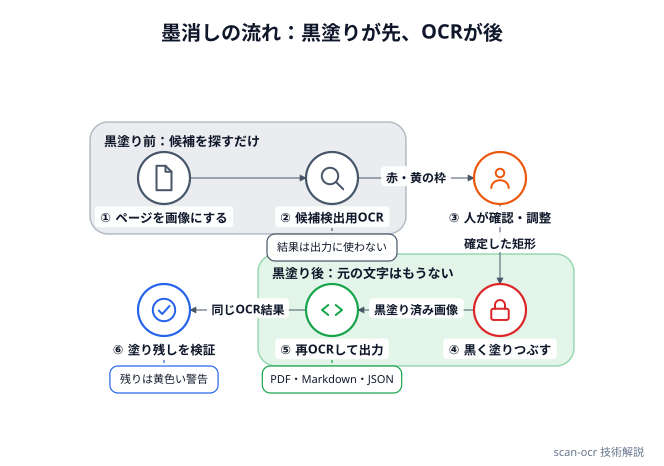

# スキャン墨消し

スキャンしたPDF・画像を **OCR して、検索できるPDF・Markdown・JSON の3つを一度に作る**ローカルWebアプリです。人名・住所などを黒塗りしてからOCRする「墨消し」機能も付いています。**文書は自分のパソコンの外に出ません。** サーバーはこのパソコンの `127.0.0.1` で動き、OCRもこのパソコンの中で行います。

- ソース：[github.com/minnanosaiban/scan-ocr](https://github.com/minnanosaiban/scan-ocr)
- OCRエンジン：[YomiToku](https://github.com/kotaro-kinoshita/yomitoku)（日本語文書に特化。CC BY-NC-SA 4.0 のため非商用のみ）

このページは、その仕組みと、作るうえで判断したことの解説です。

## 全体の構成

Python のサーバー（FastAPI）と、素の HTML / CSS / JavaScript の画面だけです。フロントエンドにビルド工程はありません。

```
app.py            サーバー（受付・進捗・ダウンロード・フォルダ一括・墨消しAPI）
ocr_pipeline.py   OCR本体（YomiToku呼び出し、3形式の書き出し、ファイル名の解決）
redact.py         墨消し本体（候補検出・黒塗りの焼き込み・残り検証）
static/           画面（index.html=通常OCR、redact.html=墨消し）
jobs/             処理中の一時ファイル（Git管理外）
```

役割はきれいに分かれています。`ocr_pipeline.py` と `redact.py` は Web を知らず、`app.py` は OCR の中身を知りません。

```
  ブラウザ ──HTTP──▶ app.py ──▶ ocr_pipeline.py ──▶ YomiToku
 (static/)            │   └───▶ redact.py ─────────┘ （OCRは ocr_pipeline の
                      │                              get_analyzer を共用）
                      └──▶ jobs/<ジョブID>/ （一時ファイル）
```

### 起動を速くする

YomiToku は torch を引き込むので、読み込むだけで10秒以上かかります。サーバー起動時に読み込むと、ブラウザが開いても画面が出ません。そこで `import yomitoku` は、実際に使う関数の中（遅延インポート）に置いています。モデルの初期化（`DocumentAnalyzer`）も重いため、`(軽量か, デバイス)` の組ごとに1つだけ作って使い回します。

## OCRは1回だけ、出力は3つ

通常のOCRは、1ページずつ次の順に進みます。

```
PDF/画像 ─▶ ページ画像（200dpi・BGR配列）
                 │
                 ▼  ページごとに1回だけ
           DocumentAnalyzer（YomiToku）
                 │ 結果（段落・表・図・単語ボックス・読み順）
      ┌──────────┼──────────┐
      ▼          ▼          ▼
   Markdown     JSON    テキスト乗せPDF
```

PDFは [pypdfium2](https://github.com/pypdfium2-team/pypdfium2) で、**200dpi の画像**にしてからOCRにかけます。解析（いちばん重い処理）は形式によらずページにつき1回で、選ばれなかった形式の変換と書き出しだけを省きます。

### 3つの形式

| 形式 | 作り方 | 中身 |
|---|---|---|
| Markdown | ページごとに YomiToku の `convert_markdown`。`<!-- page N -->` を付け、`---` でつなぐ | 見出しはH1、表は表のまま |
| JSON | 解析結果をそのまま `model_dump()`。先頭に `source`・`page_count`・`generated_at`・`engine` | 段落・表・単語ボックス・信頼度（`rec_score`）など |
| テキスト乗せPDF | 元のページ画像を貼り、その上に**透明な文字**を重ねる（reportlab） | 見た目は元のまま、検索・コピペができる |

### テキスト乗せPDFのしくみと限界

YomiToku の `create_searchable_pdf` が行っているのは次のことです。

1. ページを JPEG（品質85）にして、そのまま貼り付ける
2. 段落・表のセル・図の中の段落を**読み順**に並べ、その中に含まれる単語を取り出す
3. 各単語を、ボックスに収まる大きさのフォントで、**透明（alpha=0）**で同じ位置に描く

元のPDFを書き換えているわけではなく、「ページ画像＋透明な文字」で**作り直したPDF**です。そのため次の性質があります。

- ページの大きさが**画素数のまま**になります（200dpi なので A4 が約 1654×2339 pt）。画面で見る分には問題ありませんが、印刷時は縮小が必要です
- JPEG 再圧縮のぶん、画質がわずかに落ち、ファイルが元より大きくなることもあります
- 元のPDFにあった文字データ・注釈・しおり・メタデータは引き継がれません（次の墨消しでは、これが長所になります）
- 段落・表・図のどれにも入らなかった単語は、文字層に入りません

### 軽量モデル

画面の「軽量モデル」は、文字認識を `parseq-tiny` に替えます。CPUでは文字検出も ONNX 版にします。少し速くなる代わりに、認識精度は下がります。GPUがなければ1ページ数秒〜数十秒かかります。

### ファイル名と上書きの防止

出力名はパターン（`{stem}`＝元のファイル名、`{date}`＝実行日）で決め、既定は `{stem}_ocr` です。出力先が入力元と同じフォルダになっても、元のスキャンPDFを上書きしないようにするためです。

- `{stem}` だけを指定して元と同名になる場合は、書き出す前にエラーにします
- Windows で使えない文字（`<>:"/\|?*`）は `_` に置き換えます
- フォルダ一括では、前回の出力と思われる `*_ocr.pdf` を対象から外します。同じフォルダで何度実行しても、自分の生成物を再OCRしません

## 墨消し：黒く塗ってから、OCRし直す

PDFの墨消しで最もよくある事故は、黒い四角を**上に重ねただけ**で、下の文字が残るケースです。コピペや検索で元の文字が出ます。OCRで文字層を作る場合は、さらに別の落とし穴があります。**黒塗りの前にOCRしてしまうと、透明な文字層に元の文字がそのまま入ります。**

このアプリは、**黒塗りが先、OCRが後**にしています。

{width="700"}

※この図は、自作の関係図ツール「ＲｅｌａＧｒｉｄ」で描きました。

②の結果は候補を探すためだけに使い、最終出力には**一切使いません**。⑤のOCRは黒塗り済みの画像を読むので、塗った文字は最初から存在しません。PDFの透明な文字層にも、Markdown にも、JSON にも入りません。ページを画像にしてから描き直すため、元のPDFの文字データ・注釈・メタデータも持ち越しません。

### 候補の検出（redact.py）

検出は、「行（YomiToku の `words`）の文字列」に対して行います。比較の前に、辞書語と行の両方を揃えます。

**正規化（`normalize`）：** NFKC（全角英数→半角、半角カナ→全角カナなど）、旧字体・異体字の統一（髙→高、﨑→崎、邊→辺 など代表的な20組）、空白の除去。「髙橋」と「高橋」、「山田　太郎」と「山田太郎」が同じものとして照合されます。

**辞書：** 1行1語、`/` で表記ゆれを併記（`山田太郎 / 山田 / 太郎`）、`#` 以降はコメントです。

**照合は3段構えです。**

| 段階 | 内容 | 理由 |
|---|---|---|
| 完全一致 | 正規化した行に、辞書語が含まれる | 基本 |
| あいまい一致 | 同じ長さの部分文字列と**文字ごとに比べ、違う文字数を数える**。3文字以上の語は1文字違いまで、7文字以上は2文字違いまで許す | OCRの誤読（太郎→太朗）は「同じ長さでの取り違え」が大半。氏名は2〜4文字が多く、類似度の比率だと1文字違いで閾値を割ってしまう |
| 行をまたぐ一致 | 全行を連結した文字列で完全一致を探し、またがる行をすべて候補にする | OCRが「山田」「太郎」を別の行に分けることがある |

あいまい一致は誤検出が増えるので、行をまたぐ照合には使いません。見逃しのほうが誤検出より重い（誤検出は画面で外せる）ため、検出は広めに取っています。

**パターン：** 辞書がなくても、電話番号・郵便番号・日付（和暦・西暦・生年月日）は正規表現で拾います。照合は正規化後の文字列に当てるので、全角数字や空白入りも拾えます。

**低信頼度：** OCRの認識信頼度（`rec_score`）が 0.5 未満の行は、黄色い「要目視確認」として出します。**初期状態では墨消し対象に含めません。**誤読された文字は辞書に当たらず、見逃しの原因になるため、人に見てもらう場所を示すための枠です。

### 画面での確認

候補は、ページ画像の上に重ねた `<canvas>` に枠として描きます。

- 枠のクリックで対象／対象外を切り替え（対象外は点線）、画像のドラッグで手動追加
- 座標は**ページ画像のピクセル**で持ちます。表示の拡大縮小は `clientWidth / naturalWidth` の比率を掛けるだけで、サーバーへ送る矩形は元画像の座標に戻したものです
- **塗るのは「語」ではなく「行」の枠です。** OCRが返すのは行単位のボックスなので、行の中の一部だけを塗ることはできません。足りない・多すぎる場合は、手動で枠を足すか、対象を外します

### 焼き込み（`burn_boxes`）

保存してあるページ画像（PNG）を読み直し、矩形を **4px 広げて**黒（0,0,0）で塗りつぶします。広げるのは、OCRの枠が文字の端ぎりぎりのことがあるためです。元の配列は変更せず、塗った複製を返します。

### 検証

再OCRした結果（⑤の出力用OCRと同じもの。もう一度OCRはしません）に、辞書語やパターンがまだ残っていないかを同じ関数で調べ、残っていれば結果画面に黄色い警告で出します。低信頼度の行は誤検知が多いため、検証からは外しています。

ただし、検証が見つけられるのは「OCRが読めた文字」だけです。OCRが読めなかった文字は、塗り漏れても検証にも出ません。**自動検出はあくまで補助で、公開前に人の目で全ページを確認する前提です。**

## サーバーの作り

### ジョブとポーリング

OCRは時間がかかるので、リクエストの中では行いません。受け付けるとジョブIDを返し、処理は別スレッドで進めます。画面は1秒ごとに状態（`queued` → `processing` → `done`/`error`、処理済みページ数）を取りに行きます。ジョブの状態は**メモリ上の辞書**にあり、サーバーを止めると消えます（単一ユーザーのローカルアプリなので、データベースは持ちません）。

### OCRは1つずつ

`DocumentAnalyzer` は全ジョブで共有していて、並行利用を想定しておらず、CPUも食います。そこで OCR を行う処理は `threading.Lock` で**直列化**し、ロックを待つ間は `queued` のままにします。

墨消しの「適用」は、状態の切り替え（`phase`、`status` のリセット）を、スレッド側ではなく**リクエスト処理中に同期的に**行っています。スレッドに任せると、連打で二重に走ったり、開始直後のポーリングが前の工程（候補検出）の `done` を拾って空の結果を出したりするためです。適用に失敗したときは、ページ画像を残したまま確認画面に戻ってやり直せます。

### 一時ファイルの扱い

文書は `jobs/<ジョブID>/` に置きます。持ち越さないよう、次のように消します。

| 内容 | 消えるタイミング |
|---|---|
| アップロード原本 | 処理の直後（墨消しは、ページ画像にした直後） |
| 墨消し前のページ画像・OCR全文（`lines.json`） | 墨消しの適用が成功した直後（失敗時はやり直し用に残す） |
| 出力（`output/`） | 24時間後。または、サーバーの次回起動時に全削除 |

### ローカル専用の守り

127.0.0.1 にしか待ち受けませんが、同じパソコンのブラウザで開いている**他のサイト**から叩かれる可能性は残ります（クロスサイトのフォーム送信、DNSリバインディング）。そこで、ミドルウェアで次を拒否します。

- `Host` が `127.0.0.1:8791` / `localhost:8791` 以外
- `Origin` があり、`http://127.0.0.1:8791` / `http://localhost:8791` 以外

アップロードされたファイル名は、`..\` でジョブフォルダの外へ書き込めないよう、ディレクトリ部分を落として使います。

フォルダの選択は、サーバー側（＝このパソコン）で OS の標準ダイアログを開きます。ブラウザはパスを教えてくれないので、ローカル専用であることを前提にした作りです。

## 見つかった課題と改善案

実装を読み返して見つかったものです。

- **ファイル名には墨消しがかからない（対応済み）。** ファイル名は画像ではないので塗れません。墨消しの出力名の既定は `{stem}_墨消し済み` で、`{stem}`（元のファイル名）に人名が入っていると成果物にも残ります。そこで、適用の前に出力名を作って辞書語（正規化して比較）を探し、含まれていれば400で止めます。確認画面に戻って名前の設定を直せます。JSON の `source` は元のファイル名ではなく `(墨消し済み)` にしました。辞書に入れていない名前までは検出できません
- **`create_searchable_pdf` が、カレントディレクトリに `tmp_N.png` を一時的に書く。** 実害は出にくい（OCRは直列化されている）ものの、`run.bat` 以外から別の場所で起動すると、そこに画像が出ます。ライブラリ側の挙動なので、起動時に `jobs/` などへ移動する対処が考えられます
- **通常OCR（墨消しなし）の出力も、`jobs/` に最大24時間残る。** ダウンロードに必要なためですが、機微な文書では気になります。ダウンロード後に消す選択肢があるとよいです
- **あいまい一致は「置き換え」だけ。** 1文字の欠落・余計な文字（挿入・削除）には対応していません。2文字以下の語は完全一致のみです
- **READMEの記述の誤り。** 墨消しの説明が「軽量OCRで検出」となっていますが、実際は既定では通常のモデルで、「軽量モデル」にチェックしたときだけ軽量になります

## 今後の予定

- Markdown の項番検知とハンギングインデント
- JSON に見出し目次などの「+α」
- 墨消しの確定内容のエクスポート／インポート（同じ書類の再編集用）
