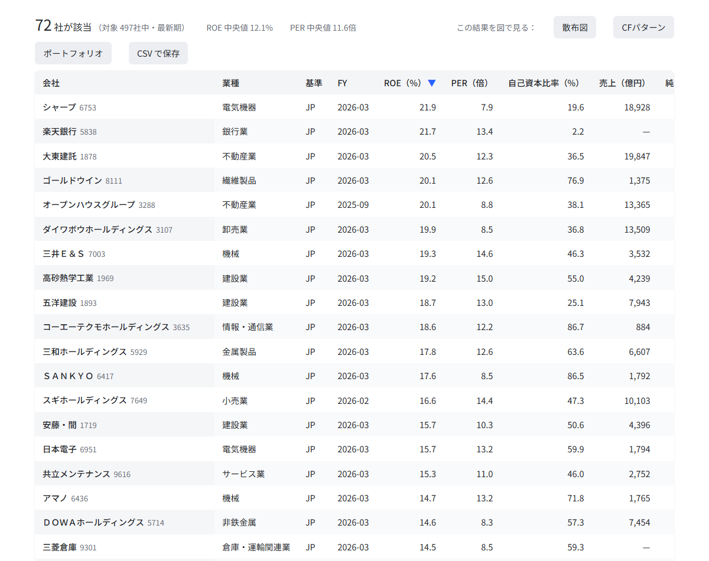
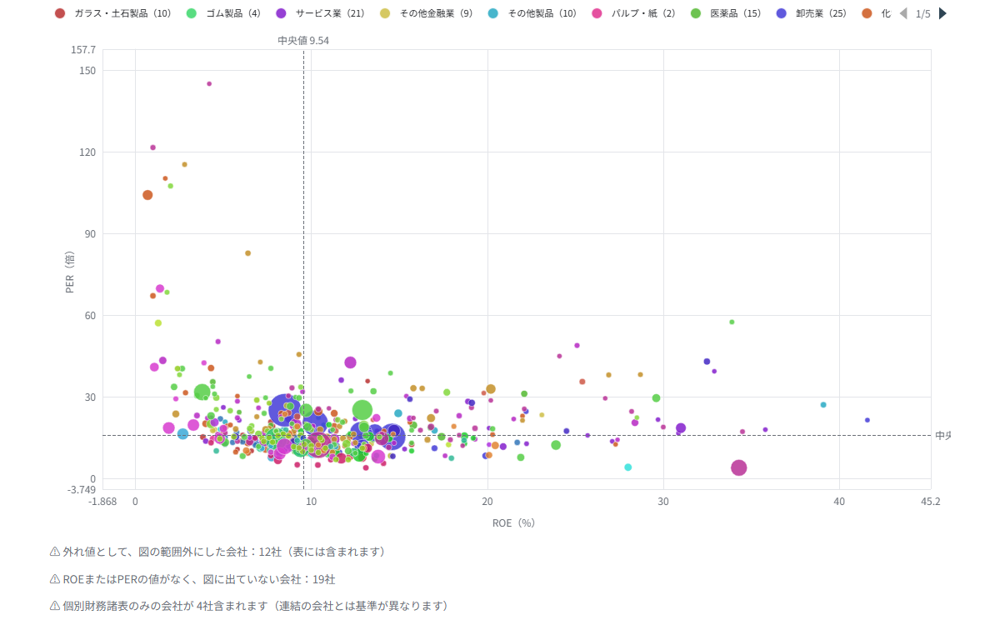
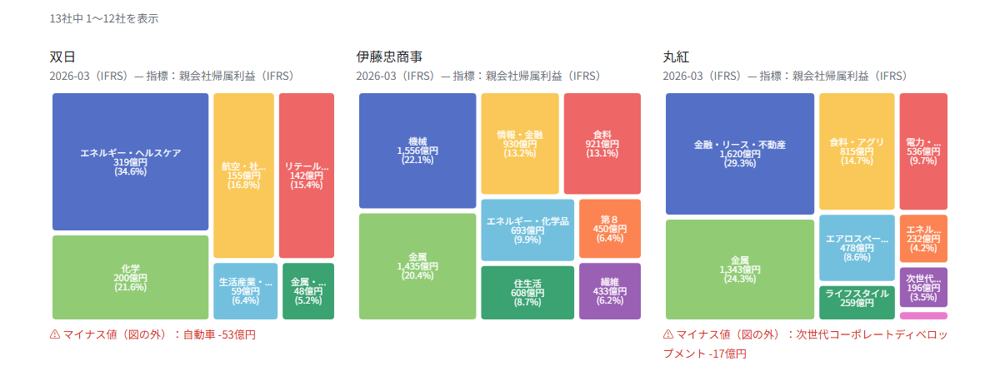

# 決算・株価データの分析連載

無料で入手できる決算短信・有価証券報告書・株価データを使った分析の連載と、その関連サイト「**企業分析**」の解説です。

- 連載：[株価分析](../blog/index.md)（記事の一覧）
- 公開サイト：[minnanosaiban.github.io/company-analysis](https://minnanosaiban.github.io/company-analysis/)
- ソース：[github.com/minnanosaiban/company-analysis](https://github.com/minnanosaiban/company-analysis)（連載の記事ごとのコードは [github.com/minnanosaiban/blog](https://github.com/minnanosaiban/blog)）

このページは、企業分析サイトの使い方と、その仕組み、作るうえで判断したことの解説です。

## 企業分析：有価証券報告書を、探して・比べる

東証の主要企業（約500社）の**有価証券報告書**（EDINET）をもとに、企業を探し、セグメント・財務指標・キャッシュフローを比べられるサイトです。ブラウザだけで動き、サーバーはありません。

連載で扱った分析のうち、**有価証券報告書だけで足りるもの**（事業の構成、収益性、キャッシュフローの型）を、誰でも触れる形にしました。「ＥＮＥＯＳ以外の会社も見てみたい」という読者の方が、自分で探せることを目指しています。

| ページ | できること |
|---|---|
| 企業を探す | 業種・会計基準・ROE・PER・自己資本比率・営業CFの符号などで絞り込み、並べ替え、CSV で保存。結果をそのまま図で見られる |
| バリュエーション散布図 | 財務指標を好きな2軸でプロット。業種で色分け、中央値の十字線、外れ値の除外、会社の強調 |
| CFパターン | 営業・投資・財務CFの符号で、経営フェーズを8パターンに分類。業種ごとの内訳も |
| 業界ポートフォリオ | 会社ごとの、事業セグメント別の利益を Treemap で並べる |
| セグメント推移 | 1社の、セグメントごとの推移を小さなグラフで並べる |

### 使い方

1. **対象を決める**：「おすすめ（商社・石油13社）」「業種から選ぶ」「会社を検索して選ぶ」「全社」から選びます。
2. **条件で絞り込む**：「企業を探す」で、数値の範囲やキャッシュフローの符号を指定します。たとえば「ROE 10%以上・PER 15倍以下・日本基準」で72社に絞れます。
3. **図で見る**：該当した会社を、散布図・CFパターン・ポートフォリオにそのまま移して見られます。

{width="1000"}

{width="1000"}

{width="1000"}

### 条件は URL に入る

選んだ会社・条件・軸は、すべて URL に保存されます。そのまま共有でき、記事から**条件つきで直接リンク**できます。

- 商社・石油の ROE と PER：[…/#/valuation?m=preset&x=roe&y=per](https://minnanosaiban.github.io/company-analysis/#/valuation?m=preset&x=roe&y=per)
- 卸売業のキャッシュフローの型：[…/#/cashflow?m=ind&ind=卸売業](https://minnanosaiban.github.io/company-analysis/#/cashflow?m=ind&ind=%E5%8D%B8%E5%A3%B2%E6%A5%AD)
- ROE 10%以上・PER 15倍以下・日本基準の会社：[…/#/?roe=10..&per=..15&std=JP](https://minnanosaiban.github.io/company-analysis/#/?roe=10..&per=..15&std=JP)

`?embed=1` を付けると、ヘッダを省いた**埋め込み用の表示**になります（出典の表示は残ります）。

## 全体の構成


ビルド工程のない素の HTML / CSS / JavaScript で、図には [Apache ECharts](https://echarts.apache.org/) を使っています。ECharts はリポジトリに**同梱**し、外部の CDN には頼りません。

```
docs/
  index.html
  assets/
    lib/        データの読み込み・絞り込み・CFパターン・図のデータ処理（画面に依存しない部分）
    pages/      各ページ
    vendor/     Apache ECharts（同梱）
  data/
    companies.json      会社の一覧（約60KB）
    financials.json     全社・全期の財務指標（約0.8MB。配信時に圧縮されて約0.2MB）
    segments/<コード>.json   会社ごとのセグメント（選んだ会社の分だけ読む）
```

データは、最初に会社の一覧と財務指標を**全部**ブラウザに読み込みます。約500社なら小さいので、検索や絞り込みはサーバーに問い合わせず、その場で終わります。セグメントだけは、選んだ会社の分を、そのつど読みます。

## データの出どころと、規約

元データは、金融庁の **EDINET** に提出された有価証券報告書（XBRL）です。手元で取得・変換して JSON にし、公開用に同期しています。

- 公共データ利用規約（第1.0版）にもとづき、**出典を表示**し、**加工した旨と加工した者**を明記しています。全ページの下部に出ます。埋め込み表示でも省きません。
- 政府が作成した情報そのものではなく、元の提出書類と異なる場合があります。
- **株価データは使っていません**。Yahoo や楽天証券のデータは、規約上、再配布できないため、このサイトには載せていません。サイトにあるのは、有価証券報告書に書かれた数字だけです。PER や ROE も、報告書の「主要な経営指標等」の値で、株価から計算したものではありません。
- EDINET の API は、規約に沿って、1秒の間隔を空けて取得しています。

## 作るうえで判断したこと

### Streamlit をやめて、静的サイトにした

最初は、手元の分析アプリ（Streamlit）の4ページを、そのまま公開することを考えました。しかし、無料で公開できる Streamlit の置き場所は、アクセスがない間に**スリープ**し、開くまで待たされます。年に数回しか変わらないデータに、動かし続けるサーバーは、必要以上に重い仕組みです。

そこで、**ブラウザの中だけで動く静的サイト**に作り直しました。サーバーがないので、スリープも、落ちる心配もありません。スマホでも軽く動き、ブログと同じ GitHub Pages に置けます。手元の分析アプリは、そのまま使い続けています。

### Python の結果と照合して、不具合を見つけた

作り直しで怖いのは、**手元の Python と、公開の JavaScript で、計算が食い違うこと**です。そこで、絞り込み・CFパターンの分類・Treemap・セグメント推移・外れ値の範囲を、Python（pandas）で**別に実装して**期待値を作り、JavaScript の結果と照合するテストを書きました。計算が一致していることを確かめる、132件のテストです。

このテストは、実際に3つの不具合を見つけました。

1. **「◯期前」の数え方がずれていた**：セグメントがない期を飛ばしていたため、INPEX などで期の対応がずれていました。
2. **名前順の並びが、環境で変わる**：ブラウザの言語設定で並びが変わる書き方でした。コード順に固定しました。
3. **スマホで横にはみ出す**：425社の長い名前で、会社の選択欄が広がっていました。

画面の見た目だけでは気づけない、数字のずれを、テストが拾ってくれました。

### 連結・個別、会計基準の違いは、隠さずに示す

- **個別財務諸表のみの会社**（連結を作らない会社）は、数字が個別のものです。連結の会社とは基準が異なるため、表に「個別」と表示し、図の下に注記を出しています。
- **金融（銀行・保険・証券）**は、売上の定義が違います。一般の会社の「売上」と混ぜず、売上の欄を空にしています。
- **米国基準・IFRS・日本基準**では、報告書の項目名が少しずつ違います。それぞれの項目名に対応させて、取り込んでいます。

## できないこと・注意点

- 対象は東証の主要企業（約500社）です。それ以外の会社は、載っていません。
- 有価証券報告書は年1回なので、**最新の四半期の数字は載っていません**。最新期は、会社ごとの直近の有報です。
- セグメント名は、日本語の名称が整っていない会社では、英字のキーを区切って表示しています。
- IFRS の会社の一部で、「売上」が空欄のものがあります（項目名の対応が、まだ足りていません）。
- 投資の助言ではありません。

## 更新

データは、手元で有価証券報告書を取得・変換し、公開用に同期して更新します。有報は年1回なので、更新は年に数回の予定です。更新日は、サイトの「データと注意」のページに出ています。
